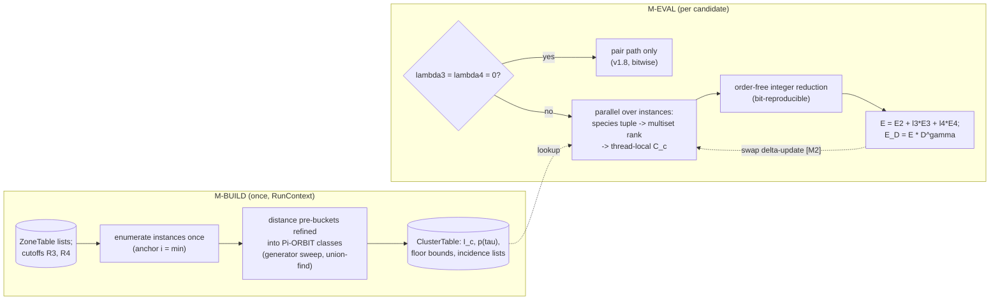
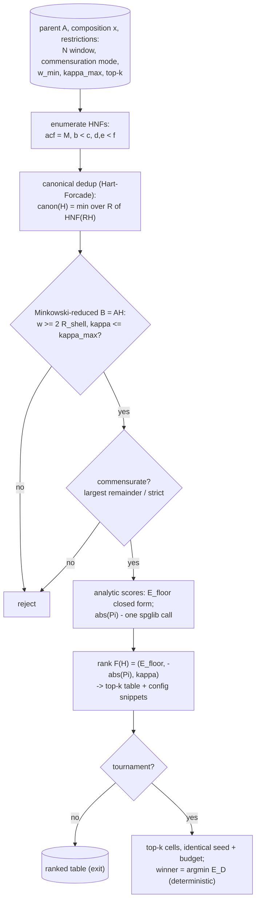

# Design v1.9 — multiplet correlations and restricted cell-shape search

Status: PLANNING (feat/v1.9-design, 2026-07-17). Two missing utilities
identified by the CPC-manuscript survey: (i) triplet and quadruplet
correlation terms in the objective, (ii) a supercell-shape search under
user restrictions. Structure of this document: theory -> algorithms ->
development & deployment.

## Part I — theoretical background (v2, 2026-07-17)

### I.1 Multiplet correlations (triplets, quadruplets)

**Cluster classes.** For k in {3, 4} let C_k be the set of k-site
subsets S of the undecorated lattice whose pair separations all lie
within a cutoff R_k (defaults: R_3 = second zone radius, R_4 = first
zone radius). Partition C_k into classes c as ORBITS under the
empty-lattice group Pi (the site_permutations group of the dedup
archive). On cubic lattices the sorted distance multiset labels the
classes in practice; the orbit definition is authoritative (it also
separates chirality-split classes on lower-symmetry parents). Each
class has an integer instance count I_c in the cell and a per-site
density nu_c = I_c / N.

Measured inventories (conventional cube a = 1; verified by direct
enumeration 2026-07-17):

  bcc  r1 = sqrt(3)/2 (z1 = 8), r2 = 1 (z2 = 6)
       triangles with sides <= r2: ONE class, isosceles (r1, r1, r2),
       nu = 12 per site; NO equilateral r1 triangles; NO r1 tetrahedra.
  fcc  r1 = 1/sqrt(2) (z1 = 12), r2 = 1 (z2 = 6)
       equilateral (r1, r1, r1): nu = 8 per site;
       isosceles (r1, r1, r2): nu = 12 per site;
       r1 tetrahedra: nu = 2 per site (the textbook two tetrahedral
       holes per fcc site -- validates the enumerator).

The contrast is physical: close packing supports compact equilateral
clusters, bcc frustrates them. Triplet sectors therefore probe fcc and
bcc decorations differently, which the pair sector cannot see.

**Occupancies and the objective sector.** For an instance decorated by
the species multiset tau (order-free), let C_c(tau) count instances of
class c decorated exactly by tau, and

    Pi_c(tau) = C_c(tau) / I_c .

The random-alloy target is the multinomial

    p(tau) = k! / prod_t mult_tau(t)!  *  prod_t x_t^{mult_tau(t)} .

The multiplet sectors keep the cancellation-free L1 form,

    E_3 = sum_{c in C_3} A_c sum_tau | Pi_c(tau) - p(tau) | ,
    E_4 analogously, and
    E   = E_2 + lambda_3 E_3 + lambda_4 E_4 ,

with per-class weights A_c decreasing with the class diameter and
lambda_3 = lambda_4 = 0 by default (bitwise v1.8 behaviour). The
composite objective stays E_D = E * D^gamma.

**Floor bound.** C_c(tau) is an integer, so every term obeys

    | Pi_c(tau) - p(tau) | >= dist( p(tau) * I_c , Z ) / I_c ,

giving the analytic sector bound

    E_floor^(k) >= sum_c A_c sum_tau dist( p(tau) I_c, Z ) / I_c .

Unlike the pair floor this bound need not be attained: pair, triplet
and quadruplet counts are coupled through the single decoration.
Reporting: the pair floor keeps its exact line; multiplet bounds are
labelled "bound" in the banner and summary.json.

**Invariance lemma.** For g in Pi and any decoration sigma, the counts
C_c(tau) of sigma and of sigma o g coincide, because g permutes the
instances WITHIN each class (classes are Pi-orbits by construction).
Hence the canonical-label archive, the [D6] symmetry-preserving
mutation and the bit-reproducibility contract carry over unchanged,
and D is untouched by definition.

**Role-resolved refinement (deferred).** In asymmetric classes the
vertex roles are inequivalent (the bcc isosceles apex sees two r1
edges; the base vertices one each). A role-resolved count
C_c(t_apex; {t_base}) is strictly finer and strictly costlier; v1.9
ships the multiset form, the role resolution is reserved as a future
knob.

**Cost model.** With the measured densities, one evaluation gains
sum_c nu_c * (#tuples) work: bcc two-zone triplets add ~12 N counting
steps against ~ (8+6) N /2 pair steps (~2x), fcc adds ~20 N (~3x);
first-zone quadruplets add 2 N (fcc) and nothing (bcc, no compact
tetrahedra below r2). The naive worst case of Part I(v1) was overly
pessimistic; the shell-restricted defaults keep the multiplet
evaluation within a small factor of the pair path. The throughput law
(evals/s x |Pi| x N ~ const) still must be re-measured (T-B1').

### I.2 Restricted cell-shape search

**Space.** Supercells of the parent lattice A are B = A H with
H in Z^{3x3}, det H = M = N / n_basis. Enumerate H in Hermite Normal
Form; two cells are equivalent iff H' = R H U with R in the parent
point group and U unimodular (Hart & Forcade, PRB 77, 224115). Only
one representative per equivalence class is kept.

**Restrictions** (the "fit better within some restrictions"):

  size            N in [N_min, N_max]
  commensuration  strict: c_t = x_t N in Z for all t; relaxed: the
                  largest-remainder counts within comp_tol = 0.02
  floor-0 test    pair floor vanishes iff x_t c_t z_n in Z for all
                  t, n -- evaluated with the closed pair-floor formula,
                  no search required
  geometry        Minkowski-reduce B; width w(H) = min_i V/|b_j x b_k|
                  >= 2 R_shell(n_s) (kills the [A3] half-width
                  warning); aspect kappa(H) = max|b_i| / min|b_i|
                  <= kappa_max
  symmetry        |Pi(H)| (translations x surviving point ops) ranked
                  DESCENDING: headroom for retained-symmetry strata
                  and low-D plateaus

**Ranking.** The primary ranking is fully analytic and instantaneous:

    F(H) = ( E_floor(H, x),  -|Pi(H)|,  kappa(H) )   lexicographic
           (a weighted scalarization is a config option).

This is the lever no competitor has: mcsqs must SEARCH each cell to
compare cells; SQuatS ranks them in closed form before any search.

**Tournament.** Optionally the top-k cells receive identical seeded
mini-budgets; the winner is argmin of the reached E_obj. The winner is
a pure function of (parent, x, restrictions, seed, k, budget), so the
whole selection inherits the bit-reproducibility contract.

## Part II — workflow (algorithms) (v2, 2026-07-17)

### II.1 Algorithm M — multiplet evaluation

**M-BUILD (once, in RunContext::build).**

    input:  ZoneTable (per-site neighbour lists), Pi (site permutations),
            cutoffs R_3 (default: zone-2 radius), R_4 (zone-1 radius)
    1  for each site i: W_i := { j : d_ij <= R_3 }        (from ZoneTable)
    2  triples: for each i, for j < k in W_i with d_jk <= R_3 and
       i = min(i,j,k): emit instance {i,j,k}               (each once)
    3  quads analogously inside R_4 (all six edges bounded)
    4  pre-bucket instances by the sorted distance multiset
    5  refine buckets into Pi-ORBIT classes: sweep the generators of Pi
       with a union-find over instances (g maps instance to instance;
       linear passes until closure) -- distance buckets only seed the
       partition, the orbit refinement is authoritative
    6  store: per class c: I_c, nu_c, the precomputed target table
       p_c(tau) and the floor-bound table dist(p tau I_c, Z)/I_c;
       per site i: incidence list [(c, partner sites...)] for the
       delta-update path
    output: ClusterTable

Multiset indexing: a decorated instance maps to the sorted species
tuple; with K <= 5 the tuple ranks into K(K+1)(K+2)/6 (triples) or
K(K+1)(K+2)(K+3)/24 (quads) slots by the combinatorial number system --
one small lookup, no hashing.

**M-EVAL (per candidate).**

    1  zero the per-class count arrays C_c[.]
    2  parallel over the instance list (static partition):
       read (sigma_i, sigma_j, sigma_k) -> multiset rank -> increment
       the thread-local C_c buffer
    3  reduce the thread buffers (integer sums: associative, order-free
       -> the bit-reproducibility contract is untouched)
    4  E_3 = sum_c A_c sum_tau |C_c[tau]/I_c - p_c(tau)|; E_4 alike
    5  E = E_2 + lambda_3 E_3 + lambda_4 E_4;   E_D = E * D^gamma

Guard: lambda_3 = lambda_4 = 0 short-circuits M-EVAL entirely (the
v1.8 code path, bitwise).

**M-DELTA (milestone M2, optional).** A [D6]/[A12] mutation swaps two
sites a, b: only the instances on the incidence lists of a and b (an
instance containing both counted once) change decoration; decrement
the old tuple, increment the new one. Cost O(nu z^2-local) per swap
instead of O(sum_c I_c) per candidate. Requires the evaluation to keep
the parent's C_c arrays alongside the child's -- deferred until the
MVP is gated.

### II.2 Algorithm C — restricted cell-shape search

**C-ENUM (subcommand `exsqs cells`).**

    input:  parent lattice A, composition x, restrictions
            (N window, commensuration mode, w_min, kappa_max, top-k)
    1  for M = N_min/n_basis .. N_max/n_basis:
         enumerate the HNFs: diagonals (a, c, f) with a c f = M,
         off-diagonals b in [0, c), d, e in [0, f)
    2  equivalence dedup: canon(H) := min over R in the parent point
       group of HNF(R H) (columns re-reduced); keep first occurrence
       of each canon (hash set) -- Hart-Forcade reduction
    3  geometry: B = A H; Minkowski-reduce B (3D Lagrange sweep);
       reject if w(H) = min_i V/|b_j x b_k| < 2 R_shell(n_s)
       or kappa(H) = max|b_i|/min|b_i| > kappa_max
    4  commensuration: counts by largest remainder; STRICT mode
       rejects unless x_t N integer for all t
    5  analytic scores per survivor:
         E_floor(H, x)  -- build_zones on the empty supercell + the
                           closed pair-floor formula
         |Pi(H)|        -- one spglib call on the empty supercell
    6  rank by F(H) = (E_floor, -|Pi|, kappa) lexicographic
       (weighted scalarization by config); emit the top-k table
       (csv/json) + ready config snippets
    output: ranked cells; optionally hand to C-TOURN

**C-TOURN (optional, `--tournament <budget>`).**

    for each of the top-k cells, in rank order:
        run the engine with the SAME seed and the SAME budget
        (islands, wall) on that cell; record min E_D
    winner := argmin; ties broken by rank order
    -- the winner is a pure function of (A, x, restrictions, seed, k,
       budget): the selection inherits the reproducibility contract

Cost note: steps 1-6 are seconds for tens-to-hundreds of candidate
cells (the zone build is O(27 N n_basis) per cell and spglib is one
call); the tournament dominates by construction and is budget-capped.

### II.3 Test workflow (unchanged from v1)

- T-M1 golden counts: brute-force multiplet counting vs ClusterTable on
  tiny cells (<= 16 sites), all lattices.
- T-M2 floor bound: exhaustive decoration enumeration on <= 16 sites
  confirms bound <= true minimum, and equality where attainable.
- T-M3 interop: triplet correlations cross-checked against icet on
  shared structures (tools/py, T-V1 pattern).
- T-C1' HNF census: enumeration counts vs the published Hart-Forcade
  sequences; T-C2' floor-0 detection reproduces the 25|N law of the
  supercell study.
- Determinism: T-K1/T-MPI1 re-run with multiplets enabled; signature
  guard tested against every new knob.

## Part III — development and deployment

Implementation follows the repository workflow (feature branches,
>= 13 commits for significant branches, every commit configures/builds/
runs, per-file bullets for 3+-file commits):

1. **feat/multiplet-correlations** — commit sketch: cluster enumeration;
   orbit classification; tuple storage; counting kernel; objective
   sectors; config keys + validation; floor bound; score parity;
   summary fields; signature extension; T-M1; T-M2; T-M3; SPEC section
   4/16 updates; T-B1 cost-law re-measurement.
2. **feat/cell-search** — commit sketch: HNF enumerator; point-group
   reduction; Minkowski + geometry filters; analytic-floor ranking;
   `cells` subcommand; tournament driver; config integration; T-C1';
   T-C2'; docs; ladder demo (does the search rediscover 5x5x5 on the
   W-Cr family, or beat it?).

Release ritual: SPEC v1.9 header + changelog entry, the four version
literals to 1.9.0, coherence C1..C9, full 24+ gate suite, merge --no-ff,
tag v1.9.0, GitHub release; LUMI/Helios rebuild note (see the T3
post-mortem: stale binaries abort under upgraded stacks). Packaging
groundwork for conda-forge follows the survey's criticism list.

Risks: (i) evaluation-cost regression — mitigate with shell-restricted
defaults and the M2 delta-evaluation; (ii) multiplet floor is a bound,
not a target — communicate clearly; (iii) HNF growth with N — cap the
window and rely on point-group reduction; (iv) config-surface bloat —
defaults must reproduce v1.8 bitwise (guarded by T-K1).

Milestones: M1 multiplet MVP -> M2 delta-eval -> C1 cells MVP ->
C2 tournament -> R: release 1.9.0 with re-run benchmark subset and a
manuscript addendum if the results warrant one.
