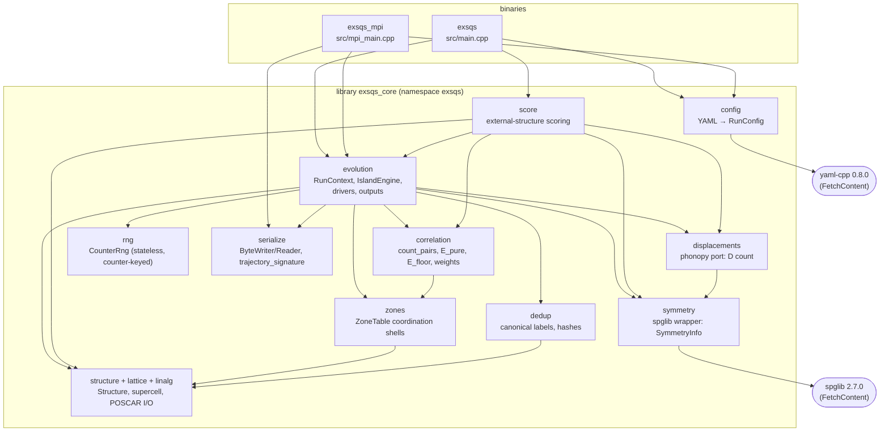
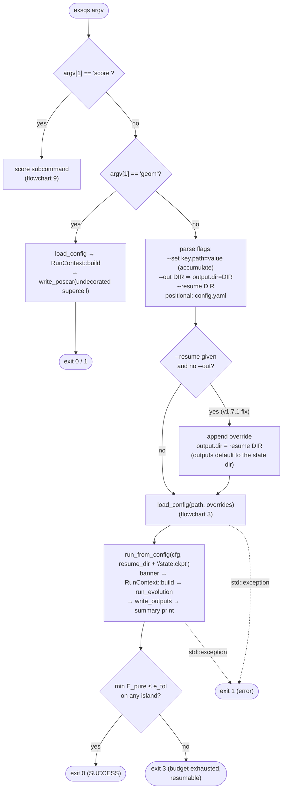
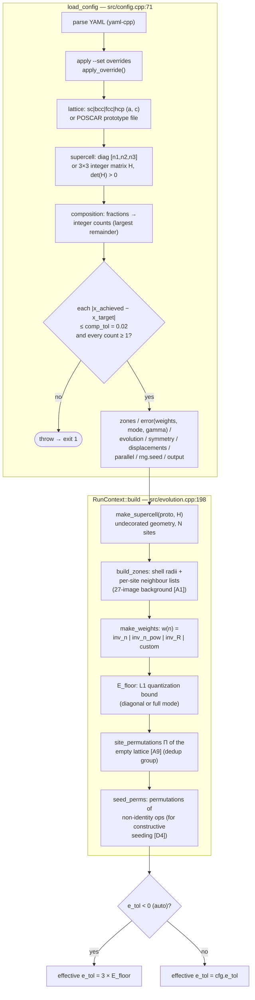
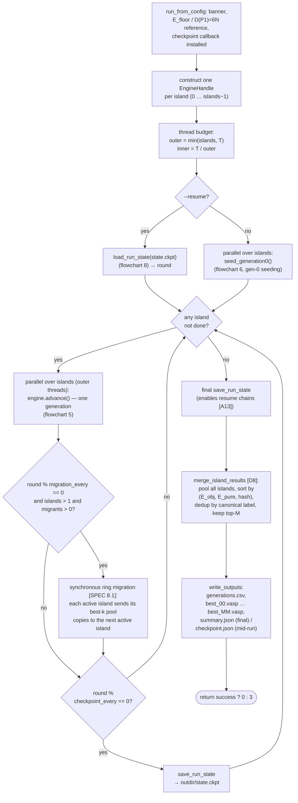
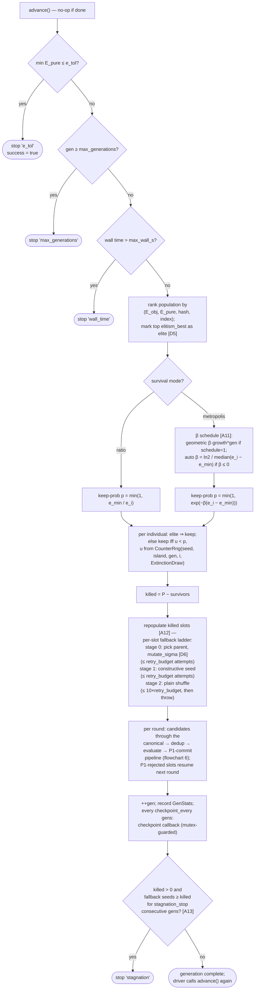
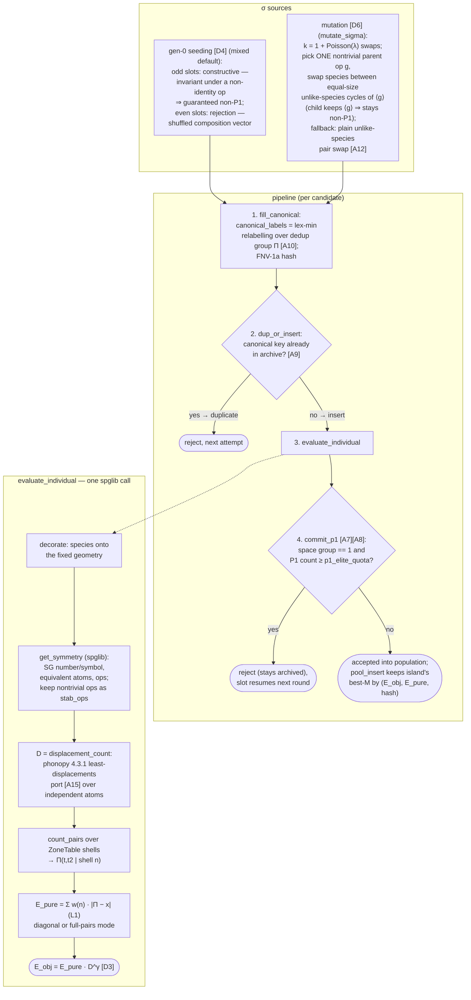
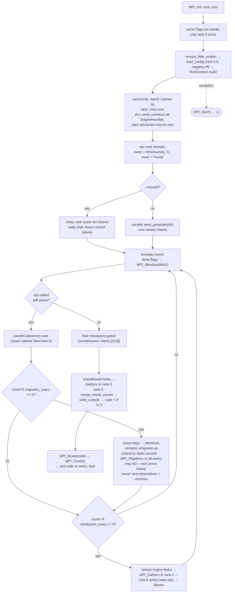
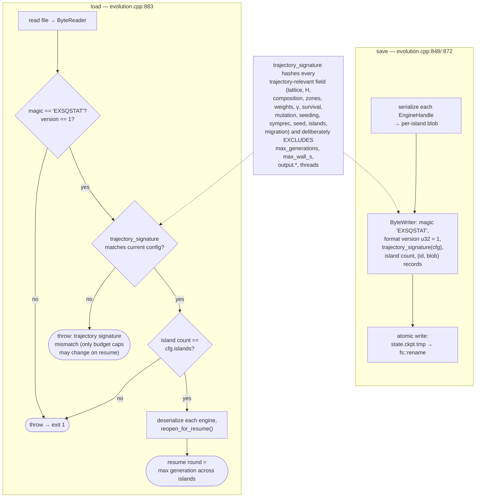
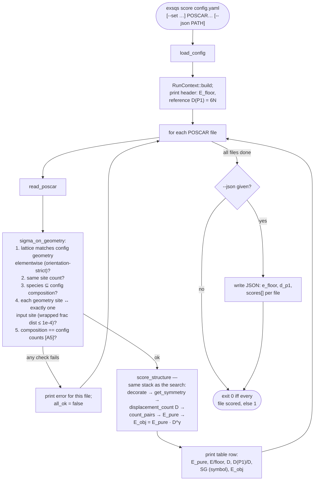

# EXSQS / SQuatS — program flowcharts

Nine flowcharts describing how the engine works, from the component map down to the
per-candidate evaluation. Every node group is mapped to its implementation
(file : line, function/class; everything lives in `namespace exsqs` unless noted).
Line numbers refer to v1.7.1. SPEC tags `[Axx]`/`[Dxx]` refer to `docs/SPEC.md`.

> This file is generated documentation and deliberately **untracked** (the curated
> history carries no meta files). View with any Mermaid-capable renderer
> (GitHub, VS Code + Mermaid extension, mermaid.live).

Contents

1. [Component map](#1-component-map)
2. [CLI dispatch and run lifecycle](#2-cli-dispatch-and-run-lifecycle)
3. [Config loading and run setup](#3-config-loading-and-run-setup)
4. [Serial driver: lockstep islands](#4-serial-driver-lockstep-islands)
5. [One generation: `IslandEngine::advance`](#5-one-generation-islandengineadvance)
6. [Candidate pipeline and evaluation](#6-candidate-pipeline-and-evaluation)
7. [MPI driver: rank-distributed islands](#7-mpi-driver-rank-distributed-islands)
8. [Checkpoint and resume](#8-checkpoint-and-resume)
9. [`score` subcommand](#9-score-subcommand)

---

## 1. Component map

Orientation diagram (not a control flow): the two binaries, the `exsqs_core`
library modules, and who calls whom. `evolution` is the hub; `score` reuses the
same evaluation stack on external structures.

Where in the code

| Node | Implementation |
|---|---|
| `exsqs` binary | `src/main.cpp` (`main` at `main.cpp:23`) |
| `exsqs_mpi` binary | `src/mpi_main.cpp` (`main` at `mpi_main.cpp:101`); built only when MPI is found (`CMakeLists.txt:74`) |
| config | `include/exsqs/config.hpp:14` (`struct RunConfig`), `src/config.cpp:71` (`load_config`) |
| evolution | `include/exsqs/evolution.hpp`, `src/evolution.cpp` (1213 lines; engine class `IslandEngine` at `evolution.cpp:359`) |
| score | `include/exsqs/score.hpp`, `src/score.cpp` |
| structure/lattice/linalg | `src/structure.cpp`, `src/lattice.cpp`, `include/exsqs/linalg.hpp` |
| zones | `src/zones.cpp:9` (`build_zones`) |
| correlation | `src/correlation.cpp` |
| symmetry | `src/symmetry.cpp:36` (`get_symmetry`, wraps `spg_get_dataset`) |
| displacements | `src/displacements.cpp` (phonopy 4.3.1 port, `[A15]`) |
| dedup | `src/dedup.cpp` |
| rng | `include/exsqs/rng.hpp:37` (`class CounterRng`), purposes enum `rng.hpp:17` |
| serialize | `src/serialize.cpp`, `include/exsqs/serialize.hpp` |

---

## 2. CLI dispatch and run lifecycle

What happens between `exsqs …` on the command line and the exit code.
Exit codes: **0** converged (min E_pure ≤ e_tol), **3** budget exhausted
(resumable, normal), **1** error.

Where in the code

| Node | Implementation |
|---|---|
| dispatch `score` | `src/main.cpp:24-50` → `run_score_cli` (`score.cpp:109`) |
| dispatch `geom` | `src/main.cpp:51-81` → `RunContext::build` + `write_poscar` (`structure.cpp:120`) |
| flag parsing | `src/main.cpp:85-115` (`--out` rewritten to `output.dir=` at `main.cpp:102`) |
| resume-output fix | `src/main.cpp:120-132` (the v1.7.1 foot-gun fix: resume defaults outputs to the state dir) |
| `load_config` | `src/config.cpp:71` |
| `run_from_config` | `src/evolution.cpp:1155-1211`; returns `out.success ? 0 : 3` at `evolution.cpp:1210` |
| exception → 1 | `src/main.cpp:137-140` |
| usage/exit-code banner | `src/main.cpp:9-21` |

---

## 3. Config loading and run setup

Two stages: `load_config` turns YAML + `--set` overrides into a validated
`RunConfig`; `RunContext::build` derives everything the run needs exactly once
(geometry, shells, weights, floor, symmetry groups).

Where in the code

| Node | Implementation |
|---|---|
| override mechanics | `src/config.cpp:35` (`apply_override`), applied at `config.cpp:83` |
| lattice / supercell / composition sections | `src/config.cpp:89` / `:114` / `:131` |
| largest-remainder rounding | `src/config.cpp:50` (`largest_remainder`), counts at `:142` |
| comp_tol gate (fixed 2%) | `src/config.cpp:144-149` |
| zones/error/evolution/… sections | `src/config.cpp:153` / `:159` / `:192` / `:275` / `:283` / `:288` / `:311` / `:312` |
| `RunContext::build` | `src/evolution.cpp:198-217`; `struct RunContext` at `evolution.hpp:70` |
| `make_supercell` | `src/structure.cpp:27` |
| `build_zones` | `src/zones.cpp:9-80` (half-cell-width warning `[A3]` at `zones.cpp:78`) |
| `make_weights` | `src/correlation.cpp:8` |
| `e_floor_diagonal` / `e_floor_full` | `src/correlation.cpp:82` / `:95` |
| `site_permutations`, `permutation_of_op` | `src/dedup.cpp:55` / `:51` |
| `effective_e_tol` | `src/evolution.cpp:219-221` |

---

## 4. Serial driver: lockstep islands

`run_evolution` advances all islands one generation per round (lockstep) with
nested OpenMP: *outer* threads across islands, *inner* threads inside each
island's evaluation rounds. Thread counts change wall time only, never results
(counter-keyed RNG `[A14]`).

Where in the code

| Node | Implementation |
|---|---|
| `run_from_config` (banner, callback, exit) | `src/evolution.cpp:1155-1211` (checkpoint callback lambda `:1183-1190`) |
| `run_evolution` | `src/evolution.cpp:954-1042` |
| engine construction | `src/evolution.cpp:957-959`; `class EngineHandle` (pimpl) `island_engine.hpp:19`, impl `evolution.cpp:820-846` |
| thread budget outer/inner | `src/evolution.cpp:963-969` |
| resume vs parallel seeding | `src/evolution.cpp:971-988` |
| lockstep round loop | `src/evolution.cpp:995-1033` |
| ring migration | `src/evolution.cpp:1016-1030` (`emigrants` `evolution.cpp:625`, `receive_migrants` nearby) |
| periodic + final state save | `src/evolution.cpp:1031-1034` |
| `merge_island_results` | `src/evolution.cpp:925-952` |
| `write_outputs` | `src/evolution.cpp:1044-1153` (`generations.csv` `:1049`, `best_%02zu.vasp` `:1075`, `summary.json`/`checkpoint.json` `:1083`) |
| single-island convenience path | `evolve_island`, `src/evolution.cpp:916-923` |

---

## 5. One generation: `IslandEngine::advance`

The v1.1 loop body: termination checks, extinction `[A11]` with elitism `[D5]`,
repopulation `[A12]` with a three-stage fallback ladder, stagnation stop `[A13]`.

Where in the code

| Node | Implementation |
|---|---|
| `IslandEngine::advance` | `src/evolution.cpp:436-622` (class at `:359`) |
| termination checks | `src/evolution.cpp:439-453` |
| ranking + elitism | `src/evolution.cpp:455-468` |
| β schedule + auto-β | `src/evolution.cpp:469-478` |
| survival draws (ratio `:490`, metropolis `:492`) | `src/evolution.cpp:482-503`; RNG purpose `ExtinctionDraw` `rng.hpp:17` |
| slot ladder (`SlotState`, stages 0/1/2) | `src/evolution.cpp:505-601` (`struct SlotState` `:516`; stage transitions `:546`, `:560`; exhaustion throw `:569-572`) |
| `mutate_sigma` `[D6]` | `src/evolution.cpp:267-346` (Poisson swap count `poisson_draw` `:254`) |
| constructive fallback | `constructive_from_rng`, `src/evolution.cpp:132` |
| record + checkpoint callback | `src/evolution.cpp:607-612` (`record` `:760`) |
| stagnation stop | `src/evolution.cpp:613-621` |

---

## 6. Candidate pipeline and evaluation

Every candidate — gen-0 seed or child — passes the same four-step pipeline.
`fill_canonical` and `evaluate_individual` are parallel-safe; `dup_or_insert`
and `commit_p1` run serially in slot order, which keeps results bit-identical
for any thread count.

Where in the code

| Node | Implementation |
|---|---|
| gen-0 seeding round loop | `IslandEngine::seed_generation0`, `src/evolution.cpp:379-432` (mixed odd/even split `:395`; exhaustion cap `:410-413`) |
| rejection / constructive seed σ | `src/evolution.cpp:230` / `:240` (+ `constructive_from_rng` `:132`) |
| `mutate_sigma` `[D6]` | `src/evolution.cpp:267-346` (cycle decomposition of ⟨g⟩ `:280-306`; cycle swap `:307-334`; plain-swap fallback `:335-343`) |
| `fill_canonical` | `src/evolution.cpp:711-714`; `canonical_labels` `dedup.cpp:67`, `hash_labels` `dedup.cpp:82` |
| `dup_or_insert` (archive) | `src/evolution.cpp:716-724` |
| `evaluate_individual` | `src/evolution.cpp:726-740` (`E_obj` formula at `:739`) |
| `commit_p1` (P1 quota) | `src/evolution.cpp:742-749` |
| `pool_insert` | `src/evolution.cpp:751-758` |
| `decorate` | `src/structure.cpp:95` |
| `get_symmetry` | `src/symmetry.cpp:36-77` (atomic numbers `:16`, `pointgroup_order` `:98`) |
| `displacement_count` | `src/displacements.cpp:89/:93` (`least_displacements` `:72/:76`; internals `disp_one` `:17`, `disp_two` `:34`, `minus_needed` `:53`) |
| `count_pairs` | `src/correlation.cpp:36` (`CorrData` `correlation.hpp:17`) |
| `e_pure_diagonal` / `e_pure_full` | `src/correlation.cpp:53` / `:66` |
| `Individual` (σ, canonical, sg, stab_ops, D, E_pure, E_obj) | `include/exsqs/evolution.hpp:18` |

---

## 7. MPI driver: rank-distributed islands

`exsqs_mpi` lifts the same lockstep schedule across processes. Islands are
owned round-robin (`island i → rank i mod R`); migration and checkpointing go
through collective byte-blob exchanges. Results are **bit-identical** to the
serial binary for any rank count (`[A14]`, gate T-MPI1).

Where in the code

| Node | Implementation |
|---|---|
| `main` | `src/mpi_main.cpp:101-302` |
| flag parsing | `src/mpi_main.cpp:109-134` |
| setup + logging silencing | `src/mpi_main.cpp:136-141` (`cfg.log_info = false` for rank ≠ 0 at `:139`) |
| ownership round-robin | `src/mpi_main.cpp:143-149` |
| thread budget | `src/mpi_main.cpp:151-157` (`local_threads` `:41`) |
| resume (all ranks read shared file) | `src/mpi_main.cpp:167-170` → `load_run_state` (`evolution.cpp:883`) |
| seeding of owned islands | `src/mpi_main.cpp:171-185` |
| done-flag `MPI_Allreduce(MAX)` | `src/mpi_main.cpp:203-210` (`:207`) |
| parallel advance | `src/mpi_main.cpp:212-225` |
| migration via `MPI_Allgatherv` | `src/mpi_main.cpp:227-260` (helper `allgather_bytes` `:51`; record codec `parse_records` `:88`; individuals codec `put/get_individuals`, `serialize.cpp`) |
| checkpoint gather to rank 0 | `src/mpi_main.cpp:187-200` (`save_state_root` lambda; `gather_bytes_root` `:69`; `save_run_state_blobs` `evolution.cpp:848`), called at `:261`, final `:263` |
| result gather + outputs + Bcast | `src/mpi_main.cpp:265-296` |
| exception → `MPI_Abort` | `src/mpi_main.cpp:297-300` |

---

## 8. Checkpoint and resume

`state.ckpt` is a little-endian binary snapshot of every island engine (RNG
counters, population, archive, pool, generation), guarded by a **trajectory
signature** that rejects any config change except raising budget caps.

Where in the code

| Node | Implementation |
|---|---|
| `save_run_state_blobs` (format + atomic write) | `src/evolution.cpp:848-870` |
| `save_run_state` (engines → blobs) | `src/evolution.cpp:872-881` |
| `load_run_state` (all checks + resume round) | `src/evolution.cpp:883-914` |
| engine (de)serialization | `EngineHandle::serialize/deserialize`, `src/evolution.cpp:844-845`; `reopen_for_resume` via handle |
| `trajectory_signature` | `src/serialize.cpp:148` (exclusion rationale documented at `serialize.hpp:99`) |
| byte codecs (`ByteWriter`/`ByteReader`, individuals, results) | `include/exsqs/serialize.hpp:19-87`, `src/serialize.cpp:29-146` |
| CLI wiring (`--resume DIR` → `DIR/state.ckpt`) | `src/main.cpp:103-108`, `:135-136`; MPI: `mpi_main.cpp:167-170` |

---

## 9. `score` subcommand

Scores externally produced structures (POSCAR) on the config geometry with the
exact evaluation stack of the search — E_pure, E/E_floor, D, SG, E_obj.

Where in the code

| Node | Implementation |
|---|---|
| CLI dispatch | `src/main.cpp:24-50` |
| `run_score_cli` (header, loop, table, JSON, exit) | `src/score.cpp:109-166` |
| `sigma_on_geometry` (all five checks) | `src/score.cpp:33-91` (lattice tol `:40`, site match tol `:61`, composition check `:84-89`) |
| `score_structure` | `src/score.cpp:93-107` |
| `read_poscar` | `src/structure.cpp:149` |
| evaluation stack | same functions as flowchart 6: `symmetry.cpp:36`, `displacements.cpp:93`, `correlation.cpp:36/:53/:66` |
| `ScoreResult` | `include/exsqs/score.hpp:18` |
